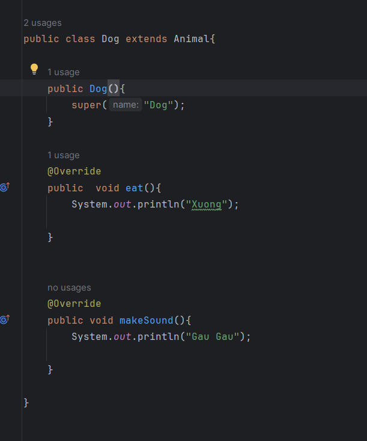
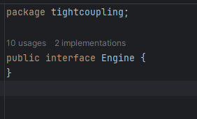

* Kiến thức Overriding và Overloading
1. Overriding

=> Dựa theo code bên trên ta đã ghi đè lại (OVerride hàm code của Anime và in ra cho Dog : Tạo ra phương thức giống lớp cha đè lên thay thế hàm hay câu lệnh bên trong);
2. Overloading

* Đây là kiến thức về tight-coupling (liên kết ràng buộc) và cách loosely coupled

- Ta khởi tạo 1 interface như ảnh  và sau đó ta tạo 2 class implements Engine 
    + Tiếp theo tạo class Car như hình  và tạo hàm main để sử dụng 
    => Với code ở trên thì ta có thể hiểu hơn về các loosely coupled ( Làm giảm sự phụ thuộc). Car đây sẽ sử dụng EngineVn,EngineTQ thông qua interface Engine. Vậy phụ thuộc giảm như thế nào ? : Đó là dù có thay đổi bất cứ gì trong EngineVn hay EngineTQ thì cx không ảnh hưởng đến Car ( Sự phụ thuộc đã giảm)

- Dependency Injection
    + Dependency : Em có cánh tay, vậy cánh tay chính là dependency
    

- Dependency Injection :  là một nguyên tắc trong lập trình hướng đối tượng nhằm giảm sự phụ thuộc giữa các thành phần của một ứng dụng ( Là truyền dependency trong lúc khởi tạo hoặc lúc set...)
    + Nhiệm vụ của dependency injection:
        - Tạo các đối tượng.
        - Quản lý sự phụ thuộc (dependencies) giữa các đối tượng.
        - Cung cấp (inject) các phụ thuộc được yêu cầu cho đối tượng (được truyền từ bên ngoài đối tượng).
    Ví dụ :  - Khi ta tiêm cái Engine vào Car này thì đấy là Dependency Injection

    + Nguyên tắc hoạt động : - Các module không giao tiếp trực tiếp với nhau, mà thông qua interface.
                             - Việc khởi tạo các module cấp thấp sẽ do DI Container/ IoC Container thực hiện.
                             - Việc Module nào gắn với interface nào sẽ được config trong file properties, trong file XML hoặc thông qua Annotation. 

- IOC ( Inversion of Control được framework quản lý và tạo ra cái container để chứa các dependency. Ở đây framework nó sẽ tự inject vào cho mình) 

* Spring boot đặt tên cho container là applicationContext và đặt tên cho các dependency là Bean
    + Vậy Bean là những module chính của chương trình, được tạo ra và quản lý bởi Spring IoC container.Ta có thể dùng @Component lên class là class đó là một bean.
    + @Component là Annotation đánh dấu trên các class để Spring biết nó là Bean
    + Đây là 1 ví dụ về Bean cũng như cách nó sử dụng 

    - Annotation trong Java là một loại metadata (thông tin mô tả) được thêm vào mã nguồn để cung cấp thông tin bổ sung về mã nguồn đó.Annotation không thay đổi chương trình khi nó được thực thi, nhưng chúng cung cấp thông tin về mã nguồn đó cho trình biên dịch, công cụ phát triển hoặc các framework và thư viện. Ví dụ cách dùng : 
    - Các Annotation : 
                     - @Component : là Annotation đánh dấu trên các class để Spring biết nó là Bean
                     - @Autowired : Annotation này có thể được áp dụng trên trường (field), constructor, hoặc setter của một bean để chú thích rằng Spring Container nên tự động inject (tiêm) một dependency (phụ thuộc) vào đó.
                     Ví dụ : 
                     - Vậy vấn đề của @Autowired là gì : Đó chính là việc nếu có >= 2 đối tượng thỏa mãn thì sao. Thì @Autowired sẽ bị lỗi và 1 số cách giải quyết có thể là @Primary,@Qualifier
                     - @Primary :  là annotation đánh dấu trên một Bean, giúp nó luôn được ưu tiên lựa chọn trong trường hợp có nhiều Bean cùng loại trong Context. Ví dụ : 
                     - @Qualifier : xác định tên của một Bean mà bạn muốn chỉ định inject. Ví dụ  và cách đó là  đặt tên các bean và sử dụng @Qualifier để ưu tiên bean mình mong muốn chạy 
                   
* @Component vs @Service vs @Repository
    - Kiến trúc Controller-Service - Repository chia project thành 3 lớp:
    Consumer Layer hay Controller: là tầng giao tiếp với bên ngoài và handler các request từ bên ngoài tới hệ thống.
    Service Layer: Thực hiện các nghiệp vụ và xử lý logic
    Repository Layer: Chịu trách nhiệm giao tiếp với các DB, thiết bị lưu trữ, xử lý query và trả về các kiểu dữ liệu mà tầng Service yêu cầu.
    - @Service : Đánh dấu class đó thuộc tầng Service phục vụ cho việc xử lí các cái nghiệp vụ
    - @Repository : Đánh dấu class đó thuộc tầng Repository phục vụ cho việc truy xuất dữ liệu
    - Về bản chất thì @Service vs @Repository đều là Component nhưng đặt tên khác nhau để giúp chúng ta phân biệt các tầng với nhau.

